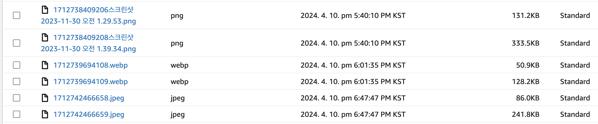

# Feature

Image Upload 서버에서 Sharp 라이브러리를 사용해 Content-type 변경하는 기능 구현

## Situation

기존 운영중인 서비스은 S3에 이미지 업로드 할 때, image/jpg로 업로드됩니다.
JPG는 PNG에 비해 작은 용량의 크기로 사진을 압축할 수 있지만 WebP와 비교했을 때 화질면에서 크게 떨어집니다.
또한, Webp는 PNG에 비해 크기가 26%, JPEG 이미지보다 25~34% 더 작습니다.

> 출처 : https://developers.google.com/speed/webp?hl=ko

## Task

- 업로드 할 이미지의 용량 축소 기능 구현
- Sharp 라이브러리를 활용하여 이미지의 Content-Type을 image/webp 로 변환

## Action

- 이미지 업로드 API의 서비스 로직에 Sharp 라이브러리로 Image의 Buffer를 webp로 변환
- 이미지 파일의 확장자를 .webp로 변환
- S3 업로드 시, ContentType을 image/webp로 설정

## Result

테스트 결과 -> 파일 A, 파일 B

> png 파일 업로드 -> 131.2 KB, 333.5 KB  
> jpeg 파일 업로드 -> 86.0 KB, 241.8 KB   > **webp 파일 업로드 -> 50.9 KB, 128.2 KB**  

로 webp 변환 시 저장 공간에 대한 효율성을 향상시킬 수 있습니다.
이는 업로드에 대한 성능 뿐만 아니라, 실제 클라이언트에게 이미지 파일이 전달될 때에 확실한 성능 차이가 보여질 것으로 판단됩니다.

