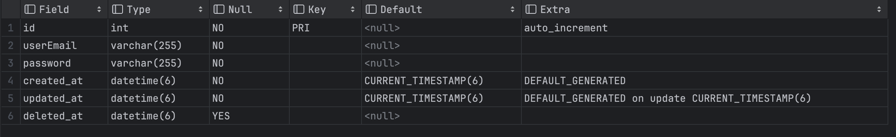
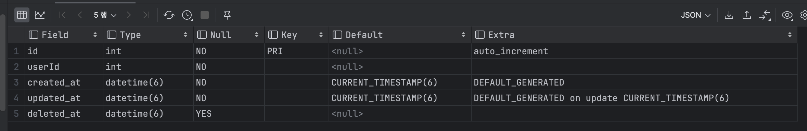

# Feature

typeORM에서 연관관계가 없는 테이블 간 join 하는 방법

## Tables

### User 테이블



### Payment 테이블



각 테이블은 연관관계를 설정하지 않았고, payment 테이블에서 userId를 저장할 수 있게 했습니다.

## Join case

모든 user에 대한 payment 정보를 조회하기 위해 join을 합니다.

```typescript
async leftJoin() {
    return await this.usersRepository
      .createQueryBuilder('user')
      .leftJoinAndMapMany('user.payment', Payments, 'payment', 'user.id = payment.userId')
      .getMany();
}
```

### 동작한 query

```shell
query: SELECT `user`.`id` AS `user_id`, `user`.`userEmail` AS `user_userEmail`, `user`.`password` AS `user_password`, `user`.`created_at` AS `user_created_at`, `user`.`updated_at` AS `user_updated_at`, `user`.`deleted_at` AS `user_deleted_at`, `payment`.`id` AS `payment_id`, `payment`.`userId` AS `payment_userId`, `payment`.`created_at` AS `payment_created_at`, `payment`.`updated_at` AS `payment_updated_at`, `payment`.`deleted_at` AS `payment_deleted_at` FROM `users` `user` LEFT JOIN `payments` `payment` ON  `user`.`id` = `payment`.`userId` AND `payment`.`deleted_at` IS NULL WHERE `user`.`deleted_at` IS NULL
```

### 리턴된 결과값

```json
[
  {
    "id": 1,
    "userEmail": "user1@example.com",
    "password": "password123",
    "created_at": "2024-05-06T16:08:37.000Z",
    "updated_at": "2024-05-06T16:08:37.000Z",
    "deleted_at": null,
    "payment": [
      {
        "id": 4,
        "userId": 1,
        "created_at": "2024-05-06T16:10:18.000Z",
        "updated_at": "2024-05-06T16:10:18.000Z",
        "deleted_at": null
      },
      {
        "id": 1,
        "userId": 1,
        "created_at": "2024-05-06T16:10:18.000Z",
        "updated_at": "2024-05-06T16:10:18.000Z",
        "deleted_at": null
      }
    ]
  },
  {
    "id": 2,
    "userEmail": "user2@example.com",
    "password": "password123",
    "created_at": "2024-05-06T16:08:37.000Z",
    "updated_at": "2024-05-06T16:08:37.000Z",
    "deleted_at": null,
    "payment": [
      {
        "id": 3,
        "userId": 2,
        "created_at": "2024-05-06T16:10:18.000Z",
        "updated_at": "2024-05-06T16:10:18.000Z",
        "deleted_at": null
      },
      {
        "id": 2,
        "userId": 2,
        "created_at": "2024-05-06T16:10:18.000Z",
        "updated_at": "2024-05-06T16:10:18.000Z",
        "deleted_at": null
      }
    ]
  },
  {
    "id": 3,
    "userEmail": "user3@example.com",
    "password": "password123",
    "created_at": "2024-05-06T16:08:37.000Z",
    "updated_at": "2024-05-06T16:08:37.000Z",
    "deleted_at": null,
    "payment": [
      {
        "id": 5,
        "userId": 3,
        "created_at": "2024-05-06T16:10:18.000Z",
        "updated_at": "2024-05-06T16:10:18.000Z",
        "deleted_at": null
      }
    ]
  },
  {
    "id": 4,
    "userEmail": "user4@example.com",
    "password": "password123",
    "created_at": "2024-05-06T16:08:37.000Z",
    "updated_at": "2024-05-06T16:08:37.000Z",
    "deleted_at": null,
    "payment": []
  },
  {
    "id": 5,
    "userEmail": "user5@example.com",
    "password": "password123",
    "created_at": "2024-05-06T16:08:37.000Z",
    "updated_at": "2024-05-06T16:08:37.000Z",
    "deleted_at": null,
    "payment": []
  }
]
```
